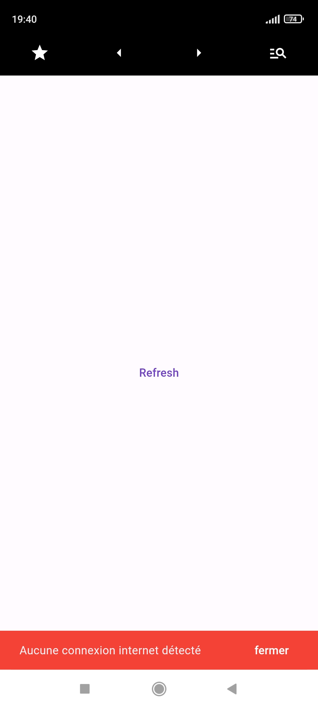
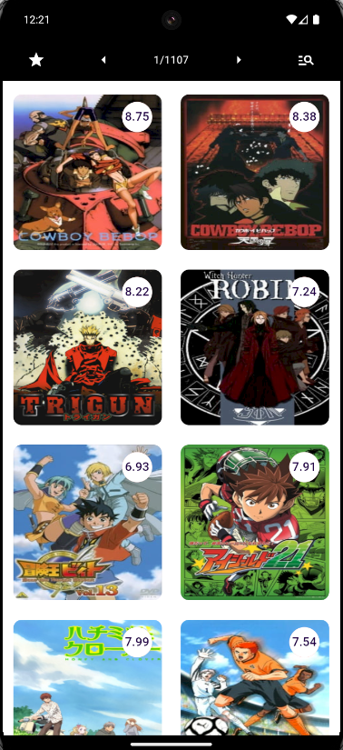
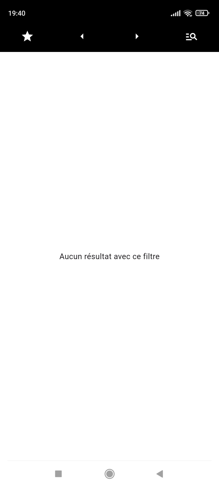
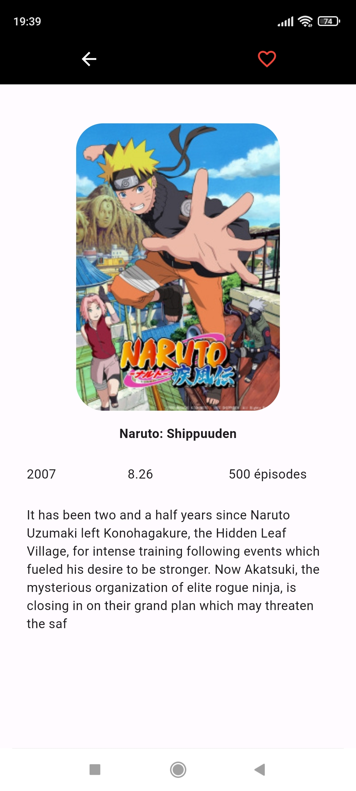
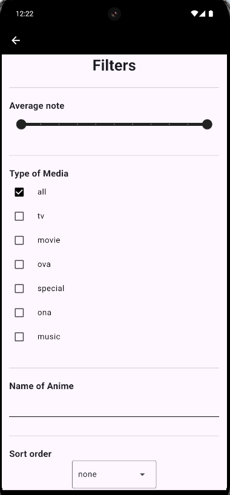
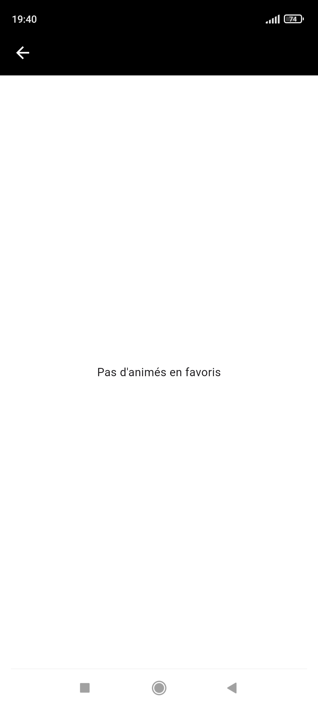
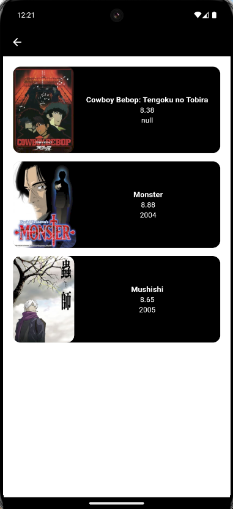
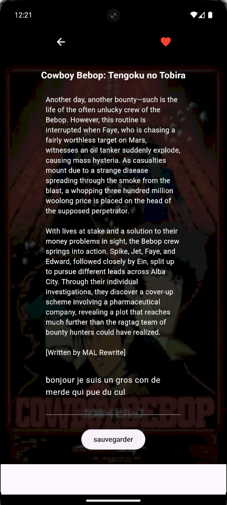

# AnimeList 

Smartphone app to have all anime list. A page filter allow to filter all animes with title, note, type of media and order by name or note.
This app allows you to save anime in local store in your phone.
The REST API is provided by https://docs.api.jikan.moe/#tag/anime/operation/getAnimeSearch .


# 👩‍💻 Installation

| Technologie | version (works) |
| --- | --- |
| java | 22 |
| dart sdk | 3.4.0 |
| flutter | 3.22.0 stable |


# 🛠 Project and funtionnalities

- Use BLoC Architecture with cubit (https://pub.dev/packages/flutter_bloc).

- UI and Data are separated in BLoC archi

- Only Front created to this app, backend already existed

- Localy database (in smartphone) for favorite animes in sqflite

# ⚡️ Execution

With VS Code, execute these commands with a smartphone emulator or your android smartphone

```bash
  dart run build_runner build --delete-conflicting-outputs
  flutter run 
```

# Visualisation

## Home page






## Page info



## Page Filtre



## Page Favoris




