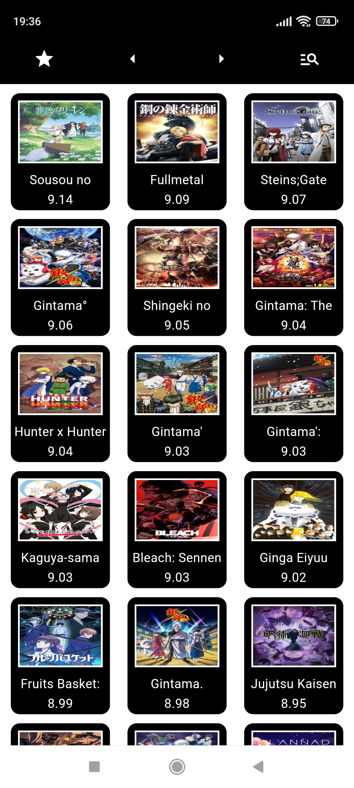
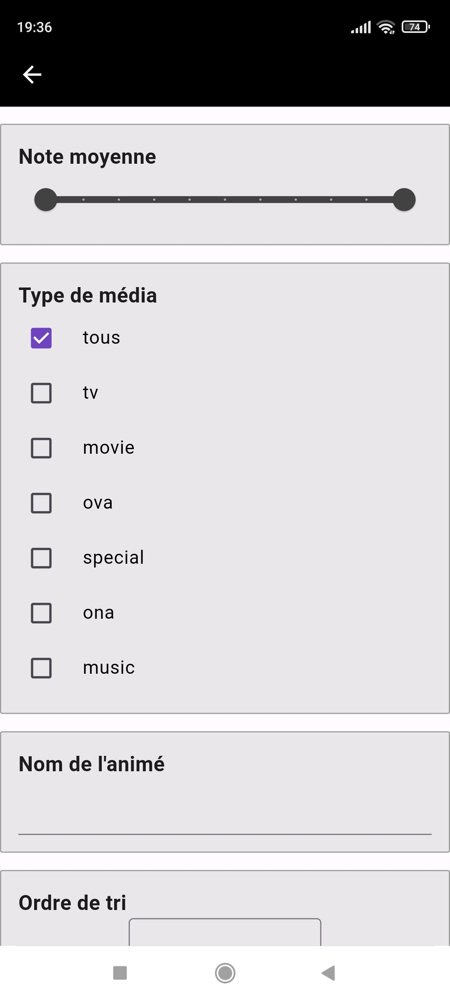
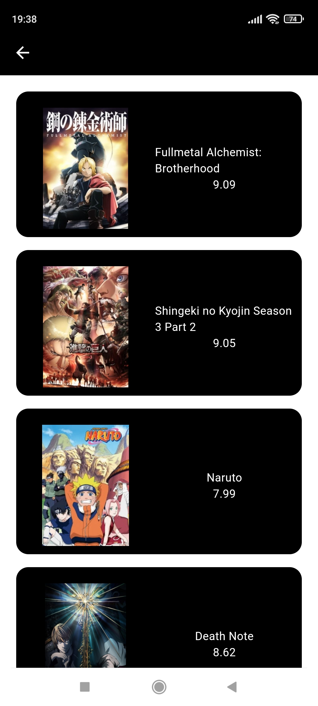
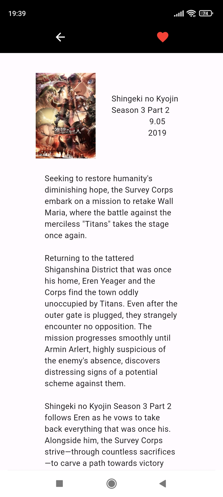

# AnimeList 

Application mobile permettant d'avoir le référencement de tous les animés existants. Il est possible de faire une recherche par filtre.
L'application permet de mettre en favoris les animés pour qu'ils soient consultables hors-ligne. Le front fait appel à une API déjà existante.

# Lancement de l'application

dart run build_runner build --delete-conflicting-outputs

flutter run 

# Visualisation

## Page accueil

La navbar permet par ordre de 1- acceder aux favoris, 2- page precedente, 3- page suivante, 4- filtrer les animes

## Page info

En cliquant sur le coeur, on peut mettre en favoris l'anime

## Page Filtre

filtre du score moyen , type de média, nom de l'animé, trier dans l'ordre (croissant et décroissant du titre, ou croissant ou décroissant de la moyenne)

## Page Favoris

Retirer des favoris un animé et annoter un animé avec un texte sans contrainte de taille.

# API utilisée

## Docs

https://docs.api.jikan.moe/#tag/anime/operation/getAnimeSearch

## Requete basique

https://api.jikan.moe/v4/anime

# Organisation du projet

- Cubit: regroupe toutes les blocs/cubit du projet avec leurs states

- Views: Regroupe les vues principales de l'application

- Widget: Tous les widgets réutilisables dans l'appli

- Services: Tous les appels dans l'appli, il en existe deux:
	- Les appels à l'API (récupére les animes ...) 
	- Les appels à la base de données locale (Animés mis en favoris)
